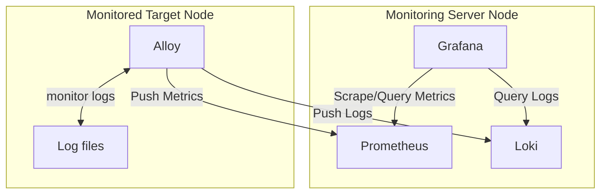

## monitoring-configuration
docker-composeで以下の監視構成を構築するための設定ファイル群

- grafana
- loki
- prometheus
- alloy



## 必要なツール
- docker/docker compose
- alloy

## 構築手順
config.alloyを修正して以下を実行.
```
cp config.alloy /etc/alloy/config.alloy
systemctl restart alloy
```

監視用のdocker network作成
```
docker network create monitoring-network
```
サービスを一通り起動
```
docker-compose up -d
```